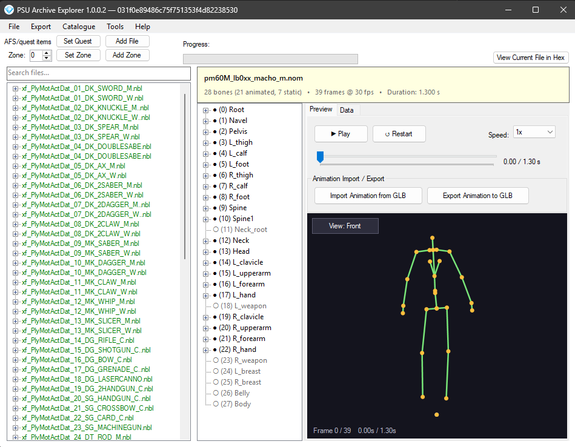
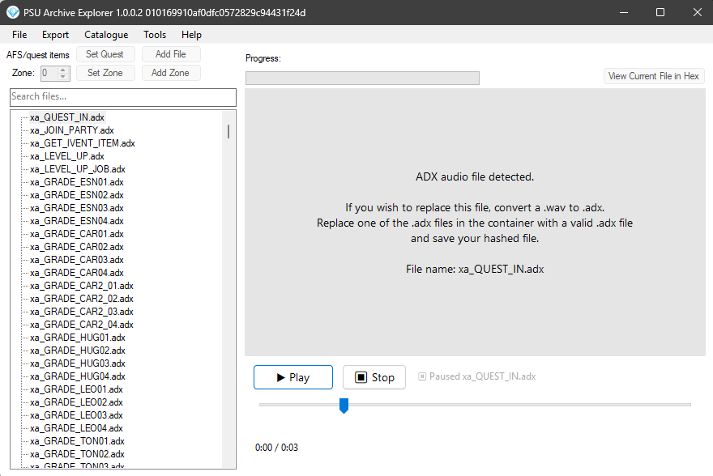

  

  <strong>PSU Archive Explorer</strong> for <em>Phantasy Star Universe</em>. 

  <strong><a href="https://github.com/Sammmy1036/PSU-Archive-Explorer/releases" style="font-size: 1.3em;">⬇️ Download Latest Release</a></strong>

## PSU Archive Explorer is a tool for browsing, extracting, and editing files from Phantasy Star Universe (PSU) game archives. It supports NBL, AFS, MiniAFS, ADX, BIN, DAT, REL, K, NOM, SFD, PSO, VSO, XNA, XNCP, XNCF, XNJ, XNM, XNR, XNT, and XVR file formats, with built-in preview for audio, video, and animation files, and export to WAV and GLB formats. 

Forked from Tenora Works PSU Generic Parser.

## Whats Changed

New Features
- Now exports ADX formats to WAV
- Now exports DAT sound formats to WAV
- Now exports NOM animation files to GLB
- Now reads/extracts archives which are identified as ADX instead of being read as null
- Now analyzes ADX mappings file to determine the actual name of certain hashed ADX files
- Now provides hints which will display if a file cannot be opened and provides possible resolution
- Now provides a preview of ADX and DAT Sound Files directly in PSU Archive Explorer prior to export
- Now provides a preview of SFD Video Files directly in PSU Archive Explorer prior to export
- Now provides preview of NOM Animation Files directly in PSU Archive Explorer prior to export
- Now provides a search bar where you can search directly for files from the hash index
- Now provides user more information regarding file types and what they do
- Now provides enhanced parsing for XNCF, XNCP, XNJ, XNR (UI Related), and XVR files

Bug Fixes
- Fixes OutOfMemoryException error (Now allows opening/exporting of large files)
- Fixes Application Not Responding when clicking large files in the tree view
- Fixes export from folder to now correctly extract all hashed files
- Fixes application and dialogue boxes not launching center screen
- Fixes application crash when clicking in the .rel tree viewer box
- Fixes application from not responding when moving the window on batch
- Fixes application crash when loading zone .rel files
- Fixes export dialogue not appearing when exporting SFD videos
- Fixes close button not working for Animation Hash Window
- Fixes file truncation for certain nbl's larger than 32 bytes

Updates
- Updated .NET framework moved to 4.8
- Updated C# language to 7.3
- Updated PSULib to now support multiple new file formats

Upcoming Features
- GLB importer allowing custom GLB's to be converted to NOM and usable in game

## How to Use the PSU Archive Explorer

Phantasy Star Universe stores most game data inside the **DATA** folder.  
Mods you create should be placed in the **Addon** folder and they will automatically load when the game launches.

1. Open the tool → **File → Open** → select a hashed file from the DATA folder or search for a file.
2. The parser will automatically decrypt the file and display its contents.

### Common File Extensions & Their Purpose

| Extension | Description |
|-----------|:------------|
| **ADX**   | Sound files (music, sound effects, voice acting) |
| **BIN**   | Text files and scripts (dialogue, menus, item descriptions, mission/enemy scripts). Often paired with **.k** files. |
| **DAT**   | General binary containers/archives (can contain almost anything) |
| **REL**   | Object and mission layout files (places enemies, props, triggers, etc.) |
| **K**     | Text/string files (alternative to .bin for localization and UI strings) |
| **NOM**   | Animation files (mainly player character animations) |
| **SFD**   | Video/cutscene files (often paired with ADX audio) |
| **PSO**   | Compiled Pixel Shader Object |
| **VSO**   | Compiled Vertex Shader Object |
| **XNA**   | Bone/skeleton name files |
| **XNCP**  | UI layout and control files (HUD, menus, interfaces) |
| **XNCF**  | Bitmap font tables that map characters to subimages in a paired XNCP atlas (HUD, menus, interfaces) |
| **XNJ**   | 3D model files, Actual Bones/Skeleton |
| **XNM**   | Model material and mesh data (usually paired with XNJ) |
| **XNR**   | Parameter/data table files (UI/HUD Scaling, item stats, weapons, enemy drops, skills, technics, AI, etc.) |
| **XNT**   | Texture list / material mapping files (links texture slots in models to actual XVR textures) |
| **XVR**   | Texture files (characters, environments, UI, etc.) |

**ADX & DAT Sound Previewer**
- Decodes audio and provides preview of ADX and DAT Sound files prior to export.

**Note**: To **replace** audio:
- Convert your `.wav` to ADX using **ADX Converter & Player** (available on GameBanana: https://gamebanana.com/tools/6491).
- Rename the resulting `.adx` to match the original hashed filename (remove the `.adx` extension).

If you want to edit audio files which are packed in .dat files, it is recommended to edit inside of Audacity in raw .dat format to preserve file headers. Otherwise, you would need to rewrite headers in a Hex Editor of your choice.

**SFD Previewer**
- Decodes and provides preview of SFD video files prior to export.

**NOM Animation Previewer**
- Decodes and provides preview of NOM Animation files prior to export.

## Special Thanks
- **Agrathejagged** — Tenora Works, documentation, and the general footing for all things modding for PSU
- **VGStream** - KC for PSU AOTI
- **Clementine Team** - Reviving and keeping the game running

## Included Third-Party Code & Dependencies
- **Costura.Fody** from Geert van Horrik & Simon Cropp - https://github.com/Fody/Costura
- **Fody** from The Fody Team - https://github.com/Fody/Fody
- **GIMSharp from Puyo Tools** - https://github.com/nickworonekin/puyotools
- **NAudio**: Allows sampling of ADPCM data - https://github.com/naudio/naudio
- **PL_MPEG**: Allows previewing of SFD video files - https://github.com/phoboslab/pl_mpeg
- **PSU Generic Parser & PSULib** - https://github.com/Agrathejagged/tenora-works
- **SharpGLTF.Core, Runtime, and Toolkit** from Vicente Penades - https://github.com/vpenades/SharpGLTF
- **WPFHexaEditor**: Hex Viewer - https://github.com/abbaye/WpfHexEditorControl

---
<a href="https://github.com/Sammmy1036/PSU-Archive-Explorer"> PSU Archive Explorer</a>

